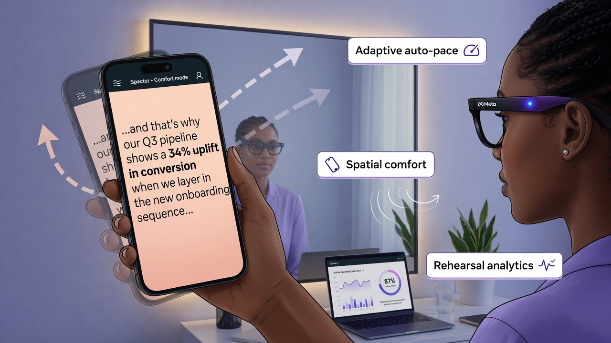
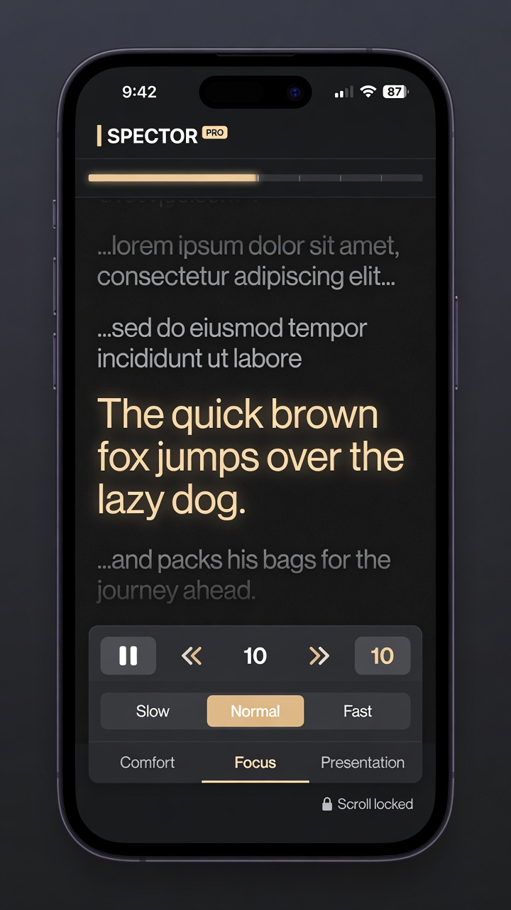

# Spector™ • Eyes Forward

**Auto-paced, comfort-tuned teleprompter for smart glasses and serious rehearsal.**

**Rehearse on your phone. Perform with confidence on glasses.**

Spector is a premium digital teleprompter PWA (software only). It gives creators, speakers, and presenters a dramatically better rehearsal experience than basic paste-and-scroll tools — plus a modular engine built for the coming smart glasses platforms.

> Not affiliated with Meta, Ray-Ban, or any glasses manufacturer. Works with any smart-glasses workflow.

---

## Live Demo & Install

**Try it instantly:** [https://spector-plum.vercel.app](https://spector-plum.vercel.app) — no account needed.

- Paste or drop a .txt script
- Open in Glasses Mode
- Choose Comfort / Focus / Presentation + Slow/Normal/Fast
- Use cue syntax for emphasis and pauses
- Get rehearsal analytics (pacing %, hesitations, slowest chunk) at the end
- **Install as PWA** for offline daily use (Add to Home Screen)

**Install prompt appears automatically** in supporting browsers after you interact with the page. Look for the "Install Spector" button.

---

## See It In Action

**Demo video & visuals** (embedded on the live site and in this repo):

Short walkthrough of launching a script, Comfort mode head-responsive effects, and the end-of-run analytics screen.

(Video: `public/spector-demo.mp4`; visuals in `assets/`.)

**Concept visuals** (phone UI + real-world usage):

These illustrate the glanceable typography, active chunk treatment, and "phone as rehearsal companion for glasses" story.

---

## Key Features

| Area                  | What Spector Delivers                              |
|-----------------------|----------------------------------------------------|
| **Script Library**    | Save, load, delete; localStorage; 20 recent max; file upload + drag/drop |
| **Adaptive Pacing**   | Hybrid chunking (sentences → ~6-word groups), punctuation-aware timing, speed presets |
| **Comfort Spatial**   | Kalman-filtered device motion → subtle head-tilt translation/rotation/scale + breathing & drift animations (Comfort mode only) |
| **Cue Markers**       | `**emphasis**` (stronger hold + styling), `[pause]`, `[pause:3s]` inline syntax |
| **Player Modes**      | Comfort (spatial + breathing), Focus (static & crisp), Presentation (larger, bold) |
| **Mirror Mode**       | Horizontal flip for camera-facing / mirror setups |
| **Customization**     | Live text size, leading, Compact HUD toggle |
| **Analytics**         | End screen: chunks, time, avg WPM, pacing consistency %, hesitations, slowest moment |
| **PWA + Offline**     | Full installable PWA, service worker v4 (network-first shells for updates), verified offline |
| **Haptics**           | Subtle vibration feedback on play, mode change, advance, etc. (where supported) |
| **Portable Core**     | `window.SpectorCore` exposed — chunking, timing, motion factory, analytics — designed for future SDK port |

**Keyboard:** Space / K = play/pause, R = rewind 3 chunks.

**Tap anywhere** (outside controls) to toggle playback.

---

## Cue Syntax Quick Reference

| Syntax              | Effect                                      |
|---------------------|---------------------------------------------|
| `**word or phrase**` | Visual emphasis + ~12% longer hold time    |
| `[pause]`           | ~2.8s pause chunk (or 1.8s mid-sentence)   |
| `[pause:3s]`        | Explicit N-second pause                    |

Cues are processed in `hybridChunkWithCues` and respected by `getMs()` timing.

---

## How It Compares to Meta's Current Teleprompter

| Aspect                    | Meta (today)                              | Spector                                      |
|---------------------------|-------------------------------------------|----------------------------------------------|
| Input                     | Paste in Meta AI app                      | Paste / .txt upload / saved library          |
| Pacing                    | Manual (Neural Band taps / swipe)         | Auto-adaptive + manual override              |
| Comfort / Presence        | Basic scroll or cards                     | Spatial anchoring + breathing/drift (Comfort) + haptics |
| Script reuse              | None                                      | Persistent library + one-tap launch          |
| Rehearsal feedback        | None                                      | Full analytics (pacing, hesitations, slowest) |
| Offline / Daily use       | Requires app connection                   | Full PWA install, offline shell              |
| Future glasses path       | In-app only                               | Modular SpectorCore ready for app store      |

**Primary use case for Ray-Ban Meta users today:** Use Spector on phone (Gen 1/2 or Display models) to perfect delivery before stepping in front of the camera or relying on the lighter in-app tool for the final take.

---

## Quick Start (Phone or Desktop)

1. Open [spector-plum.vercel.app](https://spector-plum.vercel.app)
2. Paste text, drop a `.txt`, or click one of the sample scripts
3. (Optional) Title it and **Save** to your library
4. Hit **Open in Glasses Mode**
5. Choose mode (try Comfort), speed, and text size
6. Tap Play (or press Space / tap the screen)
7. (In Comfort) Move your head gently — the text responds with subtle spatial movement
8. When done, review your pacing, hesitations, and slowest chunk on the end screen

**On real glasses (Ray-Ban Meta Display etc.):** See [TESTING.md](TESTING.md) for Developer Mode + "Add a Web App" steps.

---

## For Developers & Future Smart Glasses

- `SpectorCore` is the pure logic layer: `chunk()`, `getMs()`, `buildRehearsalAnalytics()`, `createMotion()`, KalmanFilter, cue handling, etc.
- Fully testable (run `?test` on app.html or use the committed test harnesses in `tests/`).
- Zero dependencies. Static hosting only today.
- Designed to be portable to a glasses SDK / native wrapper when app stores open.

See `public/app.html` for the full implementation + in-browser tests (search for `runSpectorCoreTests`).

---

## Project Status & Roadmap

See [PROJECT.md](PROJECT.md) for detailed shipped items, verification status, and phased plan:

- **Phase 1 (now):** Beta test on real glasses, gather feedback, polish mirror + cues.
- **Phase 2:** Cue editor toolbar, analytics history/trends, section bookmarks, export/share.
- **Phase 3:** Onboarding flow, preset scripts, landing improvements (samples, install, demo video), Neural Band gesture mapping when exposed.
- **Phase 4:** App store founding developer (SpectorCore port, one-tap send to glasses, optional sync).

Explicit non-goals for now: native mobile binaries, accounts/backend, proprietary Bluetooth protocols, video recording.

---

## Development & Verification

- All changes should keep the single `public/` output dir (see `vercel.json`).
- Run the full verifier locally: `python tests/run_verification.py` (spins up http.server + exercises browser automation for PWA/SW/tests).
- In-browser core tests: visit `app.html?test` (expects "SpectorTest: ALL PASS").
- Service worker helpers: `sw-prime.html`, `verify-sw.html`.

---

## Assets & Branding

- Logo / wordmark: text "Spector™" (premium minimal).
- PWA icons: inline SVG "S" (192/512) in `manifest.json`.
- Demo visuals live in `assets/` (for README) and `public/spector-demo.mp4` (embedded on site).

---

## Contributing

This is early. Issues and PRs welcome once public. Focus areas right now: real-glasses feedback, cue authoring UX, analytics depth, and making the "why Spector" story instantly clear to new visitors.

---

## License & Disclaimer

*(License to be added in next commit — currently MIT intent for ecosystem friendliness.)*

Spector sells **teleprompter software only**. Not smart glasses, not Meta hardware, not affiliated with Meta Platforms, EssilorLuxottica, or Ray-Ban.

---

**Built for the moment before built-in HUD teleprompters become truly great.**

Live: [spector-plum.vercel.app](https://spector-plum.vercel.app)  
Status: [PROJECT.md](PROJECT.md)  
Testing on glasses: [TESTING.md](TESTING.md)  
Source: [github.com/hydrogenbondss/SPECTOR](https://github.com/hydrogenbondss/SPECTOR)

*Last updated: June 2026 (README refresh for visibility + education).*